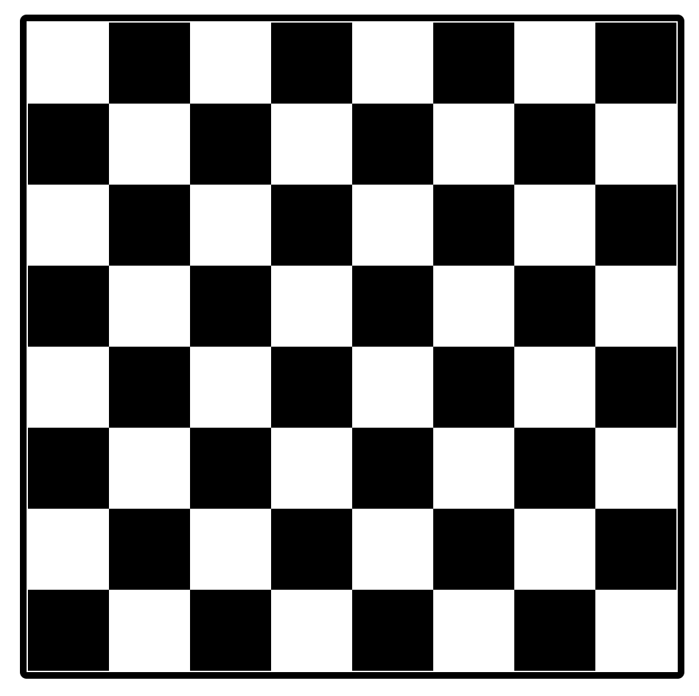

Create a chess board using HTML, CSS and Vanilla Javascript, where if you click on any of the block it should highlight its diagonals.

### Demo

> Default state

> On Click

**Chess Board:** It is a square form board in which there are equal rows and columns (8x8) with alternate intersections marked as black background.

