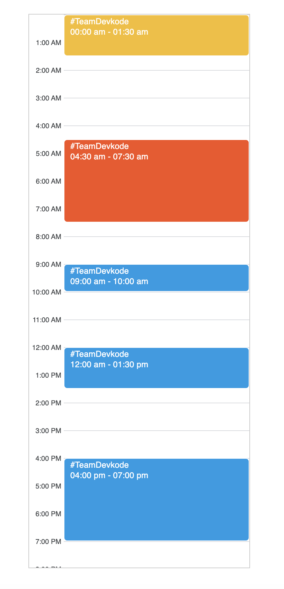
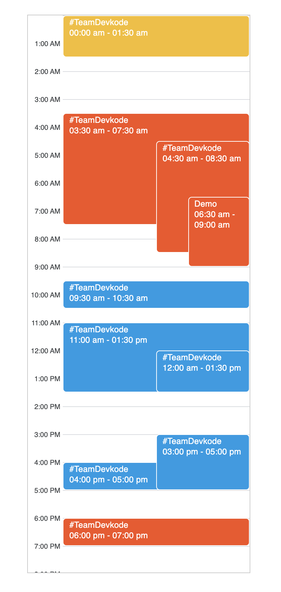

Implement Day Calendar using HTML, CSS and Vanilla Javascript.

- Implement a Calendar, that shows the events for a single day.
- The events list is provided as an array of objects where each object has a title, start time, end time, and color code.
- The calendar should have 12 hours display. (AM - PM format)
- Handle the events clashes gracefully to display all the conflicting events.
- Display the Title and Timings on the event block
- As the challenge is UI-centric, prioritize the display of events and clash management.

#### Assumptions:

- The events in the array can be in any random order.
- Event's end time will always be higher than the start time with a non zero duration.

### Demo

> Non-conflicting meetings

> Conflicting Meeting

> Demo

