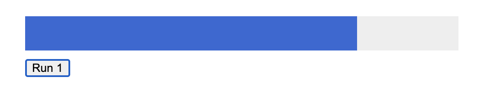
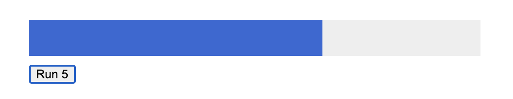

Create a progress bar using HTML, CSS and Vanilla Javascript.

- Implement a progress/loading bar that animates from 0 to 100% in N seconds. (for example: 3 seconds)
- Start loading bar animation upon a button click.
- Queue multiple progress/loading bars if the button is clicked more than once.  
  (Progress bar N starts animating with progress bar N-1 is done animating)

### Demo

> Default state

> On 1 Click

> On 5 Click (in Queue)

> Progress Bar Demo

