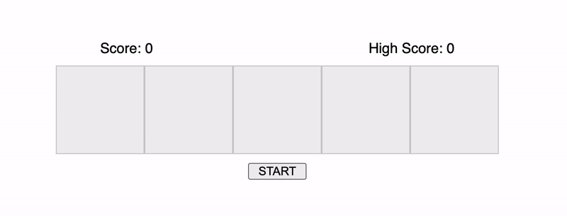

Implement Memory Game using HTML, CSS and Vanilla Javascript.

- Implement a memory game, that has a fixed number of blocks. Ex: 5 (programmatically configurable)
- Start the game on click of START button.
- Start blinking the blocks one after the other, starting from the count of 1. (single blink)
- The blinking of blocks must be completely random and the same block may blink twice in sequence.
- Let the user click the blocks in the same order of appearance.
- If user clicks are accurate, continue to the next level with the increased count.
- Else shake the container to indicate the wrong click and start over.
- Maintain the current score of the game.

#### Bonus:

- Record and maintain the High Score.
- Store the High Score in Local Storage to persist over refresh.

### Demo

> Default state

> Memory game demo

> In case of wrong attempt

